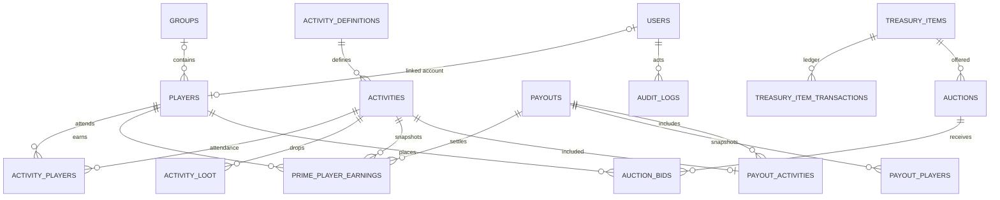

# ER-схема

`payout_activities.activity_id` уникален: один прайм нельзя включить в несколько выплат. `prime_player_earnings(activity_id, player_id)` и `activity_players(activity_id, player_id)` уникальны. Ledger-таблицы и snapshots не удаляются каскадно.

`activities.gold_value` является оценкой дропа, а не остатком золота. Фактический золотой остаток определяется только последней записью `treasury_transactions.balance_after`; автоматического переноса между этими величинами нет.

## Laravel models и связи

- `User hasOne Player`; `Player belongsTo User` (nullable, unique).
- `GuildGroup hasMany Players`; `Player belongsTo GuildGroup` (nullable = «Одиночки»).
- `ActivityDefinition hasMany Activities`; `Activity belongsTo ActivityDefinition`.
- `Activity belongsToMany Players through activity_players`.
- `Activity hasMany ActivityLoot` и `PrimePlayerEarning`.
- `Payout belongsToMany Activities through payout_activities`, `hasMany PayoutPlayer` и earnings.
- `TreasuryItem hasMany TreasuryItemTransaction` и `Auction`.
- `Auction hasMany AuctionBid`; bid и winner принадлежат Player.
